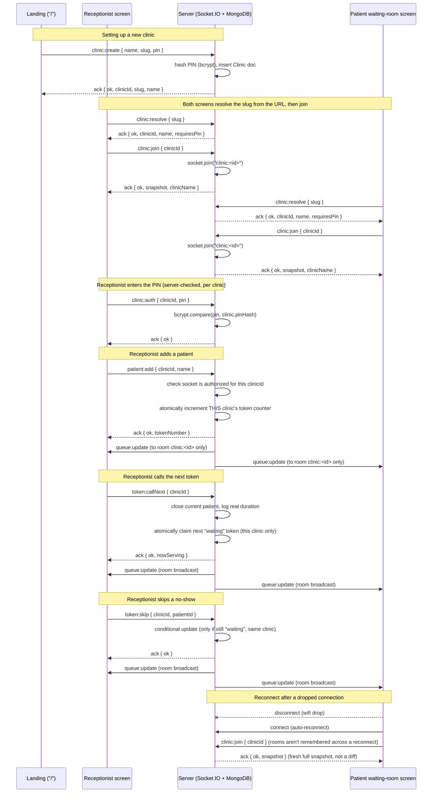

# Socket Event Diagram — Queue Cure

Every clinic gets its own Socket.IO **room** (`clinic:<clinicId>`). A
screen has to resolve a clinic, join its room, and (for Reception) pass a
PIN check before it can act — and every live update is broadcast to that
room only, never globally. That room scoping is what makes multiple
clinics safe to run from one deployment.

## Sequence diagram



## Event reference

| Event | Direction | Payload | What the server does |
|---|---|---|---|
| `clinic:create` | client → server | `{ name, slug, pin }` (ack) | Validates the slug, hashes the PIN (if any) with bcrypt, creates the `Clinic` document. Rejects duplicate slugs. |
| `clinic:resolve` | client → server | `{ slug }` (ack) | Looks up a clinic by its URL slug, returns its stable `clinicId`, display name, and whether a PIN is required. |
| `clinic:join` | client → server | `{ clinicId }` (ack) | Joins the socket to that clinic's room and returns the current full snapshot. Called on every connect/reconnect, since room membership isn't preserved across a reconnect. |
| `clinic:auth` | client → server | `{ clinicId, pin }` (ack) | Verifies the PIN against the clinic's hash. On success, marks this socket connection as authorized for that clinic — required before any of the four actions below will be accepted from it. |
| `queue:update` | server → one clinic's room | full snapshot (see below) | Pushed to every socket in `clinic:<id>` after any state change, and directly to a socket right after it joins. Both screens render straight from this — neither computes its own queue math. |
| `patient:add` | reception → server | `{ clinicId, name }` (ack) | Requires prior `clinic:auth`. Atomically increments that clinic's token counter, creates the patient, broadcasts the new snapshot to that clinic's room only. |
| `token:callNext` | reception → server | `{ clinicId }` (ack) | Requires prior `clinic:auth`. Closes the current in-consultation patient (logs real duration), then atomically claims the next `waiting` token *for that clinic*. |
| `token:skip` | reception → server | `{ clinicId, patientId }` (ack) | Requires prior `clinic:auth`. Marks a token `skipped`, but only if it's still `waiting` in that clinic. |
| `config:setAvgTime` | reception → server | `{ clinicId, minutes }` (ack) | Requires prior `clinic:auth`. Updates that clinic's manual fallback estimate only. |

## Snapshot shape (`queue:update` payload)

```json
{
  "clinicId": "665fa1...",
  "queueDate": "2026-06-24",
  "nowServing": { "tokenNumber": 12, "name": "Aarav Mehta", "consultStartTime": "..." },
  "waiting": [
    { "tokenNumber": 13, "name": "Riya Singh", "tokensAhead": 1, "estimatedWaitMinutes": 7 }
  ],
  "done": [ /* completed tokens, for the "seen today" counter */ ],
  "skipped": [ /* skipped tokens */ ],
  "config": {
    "avgConsultMinutes": 8,
    "effectiveMinutesPerPatient": 7,
    "waitTimeSource": "real-data",
    "realSampleSize": 5
  }
}
```

`clinicId` on the snapshot is what each screen checks before applying an
incoming `queue:update` — a guard against a socket that's (in theory)
joined to more than one clinic room ever rendering the wrong clinic's data.

`config.waitTimeSource` is what proves the wait estimate isn't hardcoded —
it flips from `"manual-estimate"` to `"real-data"` automatically once two or
more real consultations have happened that day, *for that clinic*, and both
screens display which mode is active.
